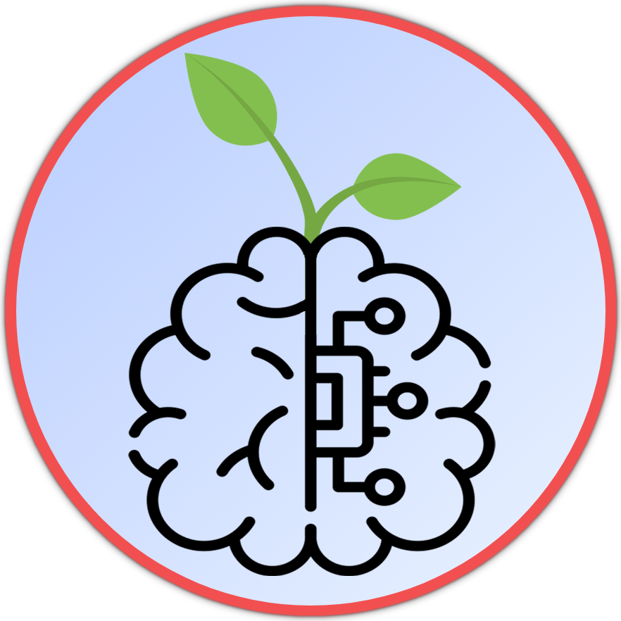

    

    
<h1 align="center">EcoWare.ai</h1>

    <h4>Rishi P. & Dharsan R.</h4>

    
## Inspiration :bulb:
We got inspiration one day trying to figure out where to recycle batteries, we went to our cities recycling page and were left extremely confused by the outdated site. We felt that almost everyone would be left confused and just leave their e-waste and recycling in the trash. 

## What it does :recycle: 
EcoWare.ai is an android app that uses ML to scan images of waste, classifies it, and gives people suggestions and direct links on proper disposal of the item. It helps reduce e-waste and promotes recycling by making information easily accessible to everyone. 

## How we built it :computer:
For the front end we built an Android app using Android Studio XML and Java. For the back end we used Azure’s custom vision service to train an ML model using various pictures of waste and labeling them. We used a data set with a total of over 2800 photos.  We then exported our ML model to TensorFlow Lite model to locally run our classification model on the android phone. 

## Challenges we ran into :construction:
This was our first hackathon project, so We ran into issues when trying to display the result Custom Vision API in our android app. So, we exported our ML learning model to a TensorFlow lite model which can be used on android phones. We also ran into various styling and formatting problems with buttons and Viewports in android. 

## Accomplishments that we're proud of
<ul>
    <li>Trained an ML model with over 2800 pictures</li>
    <li>Used Azure Custom Vision and Azure cloud services for the first time</li>
    <li>Developed our first Android App with Java</li>
    <li>Made a visually pleasing design and app</li>
</ul>

## What we learned
We learnt many things on how to develop apps in android studio using Java and XML files. We also leant how to use and train ML models using Azure. Other things we learnt were using TensorFlow files to execute ML commands on android. 

## What's next for EcoWare.ai :world_map:
Using Google's Location API to automatically locate the city and provide user with information based on their current location, instead of just the few cities that we have.

### Sources:
Portion of Images : https://github.com/AgaMiko/waste-datasets-review TensorFlow Help: https://github.com/IJ-Apps/Image-Classification-App-with-Custom-TensorFlow-Model
